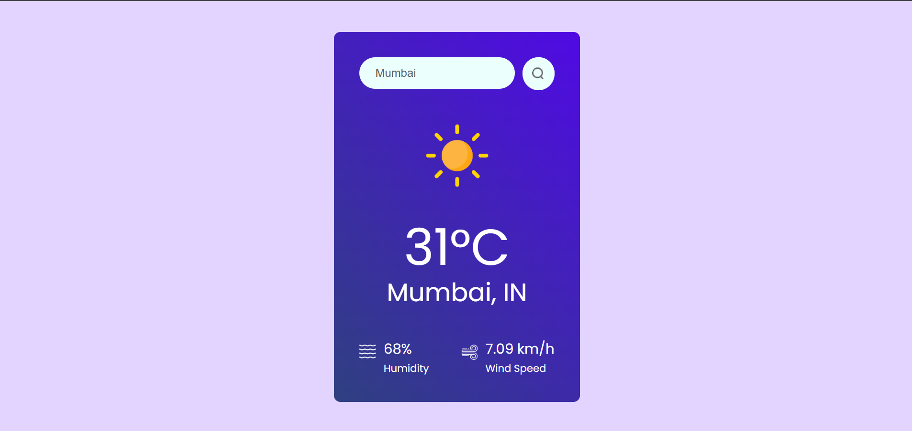

# 🌤️ Responsive Weather Application

A modern, responsive, and dynamic Weather Application built with React. This application allows users to search for real-time weather information of cities worldwide, featuring smooth UI transitions and location-based data.

👉 **[Live Demo](https://react-js-projects-coral.vercel.app/)**

---

## 📸 Preview




---

## ✨ Features

- **Real-Time Data:** Fetches up-to-date weather details including temperature, humidity, wind speed, and weather conditions.
- **Dynamic Search:** Search for weather data by city name instantly.
- **Location-Based Weather:** (Optional/If applicable) Detects user location to provide local weather forecasts.
- **Responsive Design:** Fully optimized for mobile, tablet, and desktop viewports.
- **Interactive UI:** Visually updates background scenes or icons depending on the current weather conditions (e.g., sunny, rainy, snowy).

---

## 🚀 Tech Stack

- **Frontend:** React.js (Hooks, Functional Components)
- **Styling:** CSS3 / Tailwind CSS (Modify based on your styling choice)
- **API Integration:** OpenWeatherMap API (or the specific API you used)
- **Deployment:** Vercel

---

## 🛠️ Installation and Setup

Follow these steps to run the project locally:

### 1. Clone the Repository
```bash
git clone [https://github.com/your-username/your-repo-name.git](https://github.com/rajvircodes/React-JS-Projects)
cd your-repo-name